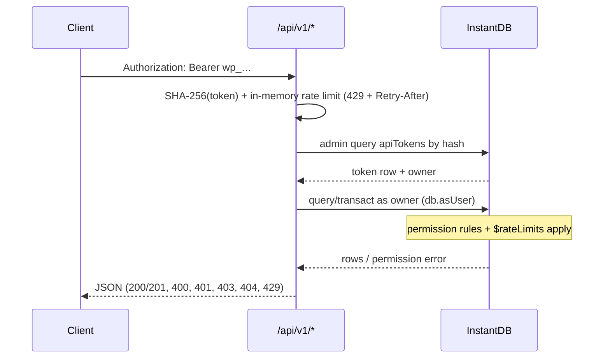

# REST API

Automate Weekly Planner with a personal access token. Create tokens on the
[account page](https://plan.ij5.dev/account) (or via `/api/tokens`), then call
`/api/v1` with `Authorization: Bearer wp_…`.

<Cards>
  <Card title="Quick start" href="#quick-start" description="Create a token and list boards in three steps." />
  <Card title="Endpoints" href="#endpoints" description="Boards, events, todos, and token refresh." />
  <Card title="Examples" href="#examples" description="curl, fetch, and Python snippets you can paste." />
  <Card title="Errors & limits" href="#rate-limits" description="Status codes, rate buckets, and retries." />
</Cards>

<Callout type="warn" title="Secrets are shown once">
  The plaintext `wp_…` value appears only when you create or rotate a token.
  Store it immediately — the server keeps a SHA-256 hash only
  (`src/server/api-tokens.js`).
</Callout>

## Base URL

| Environment | Base |
| --- | --- |
| Production | `https://plan.ij5.dev/api/v1` |
| Local (Vite + Vercel dev) | `http://localhost:3000/api/v1` |

Every request needs a bearer header:

```http
Authorization: Bearer wp_…
Content-Type: application/json
```

## Quick start

<Steps>

### Create a token

Sign in at [plan.ij5.dev/account](https://plan.ij5.dev/account), open **API 토큰**,
name the token (e.g. `automation`), and copy the `wp_…` secret when it appears.

### Verify the token

```bash tab="curl"
curl https://plan.ij5.dev/api/v1/me \
  -H "Authorization: Bearer wp_YOUR_TOKEN"
```

```js tab="fetch"
const res = await fetch('https://plan.ij5.dev/api/v1/me', {
  headers: { Authorization: 'Bearer wp_YOUR_TOKEN' },
});
console.log(await res.json());
```

```python tab="Python"
import requests

r = requests.get(
    'https://plan.ij5.dev/api/v1/me',
    headers={'Authorization': 'Bearer wp_YOUR_TOKEN'},
)
print(r.json())
```

Expected response:

```json
{
  "id": "user-id",
  "email": "you@example.com"
}
```

### List boards

```bash tab="curl"
curl https://plan.ij5.dev/api/v1/boards \
  -H "Authorization: Bearer wp_YOUR_TOKEN"
```

```js tab="fetch"
const res = await fetch('https://plan.ij5.dev/api/v1/boards', {
  headers: { Authorization: 'Bearer wp_YOUR_TOKEN' },
});
const { boards } = await res.json();
```

</Steps>

## How authorization works

The API never widens access beyond what the token owner can do in the app.
After resolving the token, the handler impersonates the owner with the admin SDK
(`db.asUser({ email })`), so Instant permission rules — board ownership,
membership, share links, and rate limits — evaluate exactly as they do for the
signed-in client.



## Endpoints

| Method | Path | Body | Notes |
| --- | --- | --- | --- |
| `GET` | `/me` | — | Token owner (`id`, `email`) |
| `GET` | `/boards` | — | Owned + member boards, with `role` |
| `POST` | `/boards` | `name?`, `from?`, `to?`, `repeatEvery?` | `201` with the created board |
| `GET` | `/boards/:id` | — | Board + its events |
| `PATCH` | `/boards/:id` | any board fields | Owner only (perms) |
| `DELETE` | `/boards/:id` | — | Cascades to events |
| `GET` | `/boards/:id/events` | — | Events for one board |
| `POST` | `/boards/:id/events` | `day`, `title`, `start`, `dur`, `color?`, `memo?` | Normalized via `eventFields()` |
| `GET` | `/events/:id` | — | Single event |
| `PATCH` | `/events/:id` | partial event fields | Merged then re-normalized |
| `DELETE` | `/events/:id` | — | |
| `GET` | `/todos?day=YYYY-MM-DD` | — | Checked-off marks |
| `POST` | `/todos` | `day`, `eventId` | |
| `DELETE` | `/todos/:id` | — | |
| `POST` | `/token/refresh` | — | Rotates the calling token |

<Callout type="info" title="Planner day grid">
  Dates are `YYYY-MM-DD`. Event `start` and `dur` are **minutes** on the
  **06:00-origin** grid (not midnight). Values are snapped and clamped like
  in-app edits (`src/board/models.js`). Colors must be one of:
  `coral`, `amber`, `green`, `teal`, `sky`, `violet`, `pink`, `graphite`.
</Callout>

## Examples

Replace `BOARD_ID`, `EVENT_ID`, and `wp_YOUR_TOKEN` with real values from your
account.

### Create a board

```bash tab="curl"
curl -X POST https://plan.ij5.dev/api/v1/boards \
  -H "Authorization: Bearer wp_YOUR_TOKEN" \
  -H "Content-Type: application/json" \
  -d '{"name":"API test","from":"2026-07-14","to":"2026-07-20"}'
```

```js tab="fetch"
const res = await fetch('https://plan.ij5.dev/api/v1/boards', {
  method: 'POST',
  headers: {
    Authorization: 'Bearer wp_YOUR_TOKEN',
    'Content-Type': 'application/json',
  },
  body: JSON.stringify({
    name: 'API test',
    from: '2026-07-14',
    to: '2026-07-20',
  }),
});
console.log(await res.json());
```

```json title="201 Created"
{
  "board": {
    "id": "board-id",
    "name": "API test",
    "from": "2026-07-14",
    "to": "2026-07-20",
    "repeatEvery": 0,
    "colorLabels": "",
    "createdAt": 1721188800000,
    "role": "owner"
  }
}
```

### Add an event

`day` is the weekday index (`0` = Sunday … `6` = Saturday). `start` is minutes
from **06:00** on that planner day; `dur` is duration in minutes.

```bash tab="curl"
curl -X POST "https://plan.ij5.dev/api/v1/boards/BOARD_ID/events" \
  -H "Authorization: Bearer wp_YOUR_TOKEN" \
  -H "Content-Type: application/json" \
  -d '{
    "day": 1,
    "title": "Standup",
    "start": 60,
    "dur": 30,
    "color": "sky",
    "memo": "Daily sync"
  }'
```

```js tab="fetch"
const res = await fetch(
  `https://plan.ij5.dev/api/v1/boards/${BOARD_ID}/events`,
  {
    method: 'POST',
    headers: {
      Authorization: 'Bearer wp_YOUR_TOKEN',
      'Content-Type': 'application/json',
    },
    body: JSON.stringify({
      day: 1,
      title: 'Standup',
      start: 60,
      dur: 30,
      color: 'sky',
      memo: 'Daily sync',
    }),
  },
);
console.log(await res.json());
```

```json title="201 Created"
{
  "event": {
    "id": "event-id",
    "boardId": "board-id",
    "day": 1,
    "title": "Standup",
    "start": 60,
    "dur": 30,
    "color": "sky",
    "memo": "Daily sync",
    "createdAt": 1721188800000
  }
}
```

### Patch an event

Send only the fields you want to change. The server merges onto the stored row
and re-normalizes.

```bash tab="curl"
curl -X PATCH "https://plan.ij5.dev/api/v1/events/EVENT_ID" \
  -H "Authorization: Bearer wp_YOUR_TOKEN" \
  -H "Content-Type: application/json" \
  -d '{"title":"Standup (async)","dur": 15}'
```

```js tab="fetch"
await fetch(`https://plan.ij5.dev/api/v1/events/${EVENT_ID}`, {
  method: 'PATCH',
  headers: {
    Authorization: 'Bearer wp_YOUR_TOKEN',
    'Content-Type': 'application/json',
  },
  body: JSON.stringify({ title: 'Standup (async)', dur: 15 }),
});
```

### Mark a todo done

Todos are per-user checkmarks on schedule events for a planner day.

```bash tab="curl"
curl -X POST https://plan.ij5.dev/api/v1/todos \
  -H "Authorization: Bearer wp_YOUR_TOKEN" \
  -H "Content-Type: application/json" \
  -d '{"day":"2026-07-17","eventId":"EVENT_ID"}'
```

```bash tab="curl — list"
curl "https://plan.ij5.dev/api/v1/todos?day=2026-07-17" \
  -H "Authorization: Bearer wp_YOUR_TOKEN"
```

### Rotate the calling token

No session required — the bearer token refreshes itself. The old value stops
working immediately.

```bash tab="curl"
curl -X POST https://plan.ij5.dev/api/v1/token/refresh \
  -H "Authorization: Bearer wp_YOUR_TOKEN"
```

```json title="200 OK"
{
  "id": "token-row-id",
  "token": "wp_NEW_SECRET",
  "prefix": "wp_abcd"
}
```

<Callout type="idea" title="Session-based token management">
  While signed in, you can also manage tokens through `/api/tokens` with the
  Instant refresh token in the `token` header — the same convention as
  [`/api/invite`](/docs/api/invite). The account page uses this path for
  create, rotate, and revoke.
</Callout>

## Token lifecycle

`/api/tokens` manages tokens with the signed-in session (header `token` =
Instant refresh token):

| Method | Action |
| --- | --- |
| `GET` | List (`id`, `name`, `prefix`, `createdAt`, `lastUsedAt`; never the secret) |
| `POST { name? }` | Create (≤ 10 per account; guests rejected) |
| `POST { rotate: id }` | New secret for an existing token |
| `DELETE { id }` | Revoke |

Clients may list/revoke their own rows directly through Instant (`apiTokens`
perms), but the `hash` field is unreadable and create/update are server-only.

## Rate limits

Two layers, both token buckets
([Instant rate limits](https://www.instantdb.com/docs/rate-limits)):

1. **API layer** — 120 requests/minute per token (`src/server/rest.js`
   `createRateLimiter`); exceeding it returns `429` with `Retry-After`.
2. **Instant `$rateLimits`** (`instant.perms.ts`) — enforced inside permission
   rules for every writer, app or API: `eventWrites` (120/min burst,
   2000/day sustained, keyed by `auth.id`, or by share secret for guests)
   and `todoWrites` (300/hour). Rule order matters: `rateLimit.limit()` sits
   last in the `&&` chain so denied writes never consume tokens.

<Callout type="warn" title="Handle 429s">
  Read the `Retry-After` header (seconds) and back off before retrying. Burst
  automation against event writes can hit both layers.
</Callout>

## Errors

JSON `{ "error": "…" }` with conventional statuses:

| Status | Meaning |
| --- | --- |
| `400` | Invalid payload or validation |
| `401` | Missing or unknown bearer token |
| `403` | Owner lacks permission for this row |
| `404` | No such row or route |
| `429` | Rate-limited (API or Instant) |
| `500` | Server misconfiguration or unexpected failure |

Instant permission failures are mapped in `instantErrorStatus()` inside
`src/server/rest-api.js` (served via `api/v1/[a].js` and nested `[b]`/`[c]`
entrypoints — Vite on Vercel has no catch-all API routes).

```json title="401 Unauthorized"
{ "error": "Invalid token" }
```

```json title="403 Forbidden"
{ "error": "Not allowed" }
```

```json title="429 Too Many Requests"
{ "error": "Rate limit exceeded" }
```

Response headers on `429`:

```http
Retry-After: 42
```
