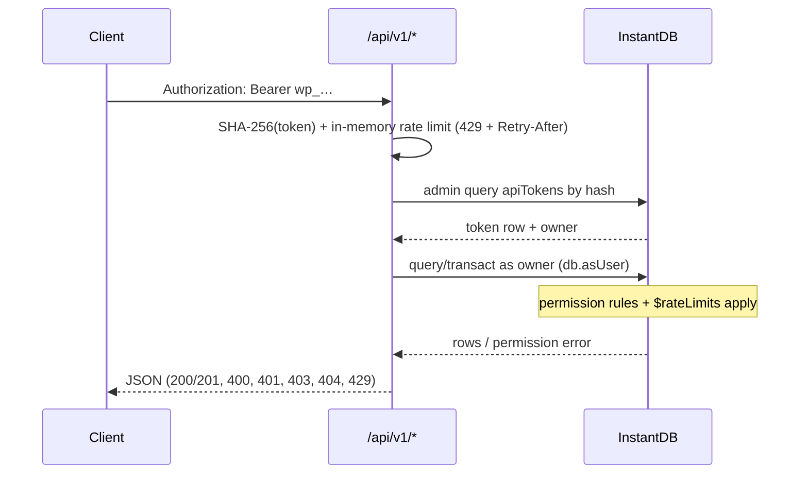

# REST API

Base URL: `/api/v1` (Vercel function `api/v1/[...path].js`). Every request is
authenticated with a personal access token sent as a bearer header:

```bash
curl https://plan.injoon5.com/api/v1/boards \
  -H "Authorization: Bearer wp_…"
```

Tokens are created on the [account page](/docs/features/account) (or via
`/api/tokens`). Only a SHA-256 hash is stored — the plaintext `wp_…` value is
shown exactly once at creation/rotation (`src/server/api-tokens.js`).

## How a request is authorized

The API never widens access beyond what the token's owner can already do in
the app: after resolving the token, the handler impersonates the owner with
the admin SDK (`db.asUser({ email })`), so Instant permission rules — board
ownership, membership, share links, rate limits — evaluate exactly as they do
for the signed-in client.



## Endpoints

| Method | Path | Body | Notes |
| --- | --- | --- | --- |
| GET | `/api/v1/me` | — | Token owner (`id`, `email`) |
| GET | `/api/v1/boards` | — | Owned + member boards, with `role` |
| POST | `/api/v1/boards` | `name?`, `from?`, `to?`, `repeatEvery?` | 201 with the created board |
| GET | `/api/v1/boards/:id` | — | Board + its events |
| PATCH | `/api/v1/boards/:id` | any board fields | Owner only (perms) |
| DELETE | `/api/v1/boards/:id` | — | Cascades to events |
| GET | `/api/v1/boards/:id/events` | — | |
| POST | `/api/v1/boards/:id/events` | `day`, `title`, `start`, `dur`, `color?`, `memo?` | Normalized via `eventFields()` |
| GET | `/api/v1/events/:id` | — | |
| PATCH | `/api/v1/events/:id` | partial event fields | Merged then re-normalized |
| DELETE | `/api/v1/events/:id` | — | |
| GET | `/api/v1/todos?day=YYYY-MM-DD` | — | Checked-off marks |
| POST | `/api/v1/todos` | `day`, `eventId` | |
| DELETE | `/api/v1/todos/:id` | — | |
| POST | `/api/v1/token/refresh` | — | Rotates the calling token |

Dates are `YYYY-MM-DD`; event `start`/`dur` are minutes on the 06:00-origin
grid and get snapped/clamped exactly like in-app edits (`src/board/models.js`).

## Token lifecycle

`/api/tokens` manages tokens with the signed-in session (header `token` =
Instant refresh token, same convention as [`/api/invite`](/docs/api/invite)):

- `GET` — list (`id`, `name`, `prefix`, `createdAt`, `lastUsedAt`; never the secret)
- `POST { name? }` — create (≤ 10 per account; guests are rejected)
- `POST { rotate: id }` — new secret for an existing token
- `DELETE { id }` — revoke

A token can also refresh **itself** without a session via
`POST /api/v1/token/refresh` — the old value stops working immediately and
the response is the only time the new one appears. Clients may list/revoke
their own rows directly through Instant (`apiTokens` perms), but the `hash`
field is unreadable and create/update are server-only.

## Rate limits

Two layers, both token buckets ([Instant rate limits](https://www.instantdb.com/docs/rate-limits)):

1. **API layer** — 120 requests/minute per token (`src/server/rest.js`
   `createRateLimiter`); exceeding it returns `429` with `Retry-After`.
2. **Instant `$rateLimits`** (`instant.perms.ts`) — enforced inside permission
   rules for every writer, app or API: `eventWrites` (120/min burst,
   2000/day sustained, keyed by `auth.id`, or by share secret for guests)
   and `todoWrites` (300/hour). Rule order matters: `rateLimit.limit()` sits
   last in the `&&` chain so denied writes never consume tokens.

## Errors

JSON `{ "error": "…" }` with conventional statuses: `400` invalid payload,
`401` missing/unknown token, `403` the owner lacks permission, `404` no such
row/route, `429` rate-limited. Instant permission failures are mapped in
`instantErrorStatus()`.
