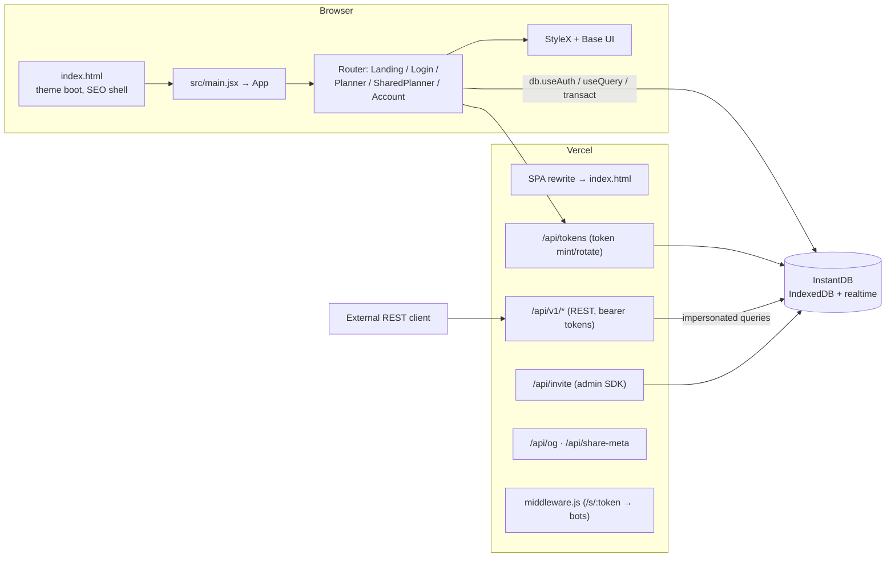

# Architecture

Weekly Planner is a single-page app with a thin Vercel edge/API layer for the REST API, invites, and social metadata.

## Entry points

### `index.html`

Static shell: `#app`, Pretendard font, baseline OG tags, and a pre-React script that:

1. Reads `weekly-planner.theme` (or legacy `weekly-planner.v2` theme)
2. Falls back to system dark preference
3. Sets `theme-color` before first paint
4. Adds `maximum-scale=1` on iOS to reduce input zoom

### `src/main.jsx`

- `bootDocumentTheme()`
- Renders `<App />` in `StrictMode` (PWA registration + refresh banner live in `<RefreshBanner />`)

### `src/router.jsx`

TanStack Router tree with Instant auth in context. See [Routing](/docs/architecture/routing).

## Layering conventions

| Layer | Location | Rule |
| --- | --- | --- |
| Pure domain | `models.js`, `*policy.js`, `time.js`, `drag.js`, … | No React, no Instant side effects |
| Transactions | `tx/*`, `transaction.js` | Build Instant txs; hooks commit them |
| Hooks | `hooks/*` | Compose queries + mutations + UI state |
| Components | `components/*` | Presentation + gesture wiring |
| Server | `api/*`, `middleware.js` | Admin SDK, OG, crawlers |

Prefer **pure functions + tests** for grid math, share state machines, and policy. Hooks wrap Instant and return command results via `command-result.js` (`ok` / `fail` / `isOk`).

## Two planner shells, one runtime

`Planner` (authenticated) and `SharedPlanner` (public link) both use `usePlannerRuntime`, which composes clock, mutations, editor, view controls, presence, and print. They differ in:

- user / auth
- `ruleParams` for share writes
- whether board tabs, share panel, and todos appear

See [Features](/docs/features) for product behavior.
